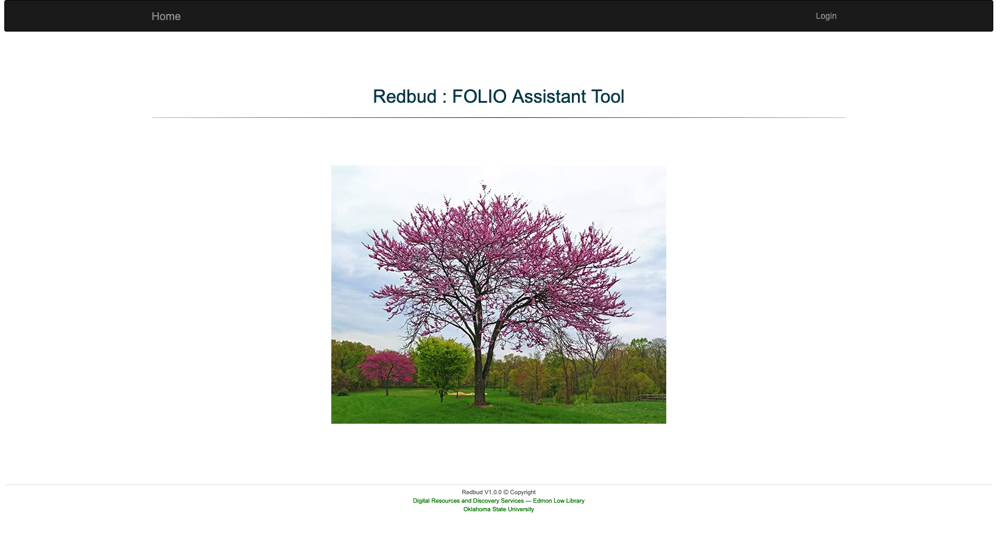

# Redbud : FOLIO Assistant Tool
Empowering FOLIO with Smart Automation and Seamless Integration

Rebud FOLIO Assistant is a powerful support tool built to enhance your FOLIO ecosystem through smart integrations, bulk data operations, customizable reporting, and seamless connections with third-party systems. Designed to simplify complex workflows, the Assistant streamlines repetitive tasks, boosts productivity, and ensures data consistency across platforms — making your FOLIO experience more efficient, scalable, and future-ready.

## Tech Stack

Spring Boot/Spring Data/Spring Security/Hibernate/MySQL/REST

There are several types of roles, with Administrator being the highest.

## Things to run the application.

__Clone the repository__
```
git clone https://github.com/okstate-library/redbud.git
```

__Go the folder__
```
src/main/resources/sql and run the "make_database.sql" SQL in MySql DBMS.
```
The administrator user name and password are "admin". After setup the system user can change his/her password.

__Set Your MySQL user name & password in application.properties__

Change the server, user name and password on [application.properties](../../blob/master/src/main/resources/application.properties)

__Run the application__
```
mvn clean spring-boot:run
```

## Screen shots.

### Index Page



## Build application and run on a live environment.

###### Build application
```
mvn clean build
```

###### Run application
```
java -jar target/redbud-0.0.1.jar
```

Check the URL "http://localhost:8080".
